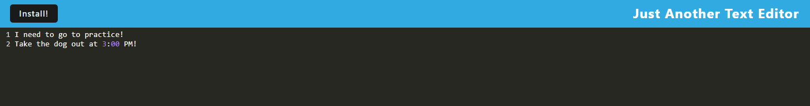

# PWA Text Editor

This application allows the user to create notes with or without internet connection. It will also allow the user to access these notes at any time in the future!

## Getting Started

These instructions will get you a copy of the project up and running on your local machine for development and testing purposes. See deployment for notes on how to deploy the project on a live system.

1. Download the code.
2. Open your favorite coding program.
4. Run NPM install
5. NPM Run Build
6. Run NPM Start, to start the local server on local host 3000.

### Installing

*Download the code, see above!

## Deployment

Please use the Github direct application link to access the code base.

https://github.com/SandersonHub/pwa-text-editor

Heroku Application:

https://pwa-text-editor-1321234124-6af2e1484b82.herokuapp.com/

## Built With

* [JavaScript](https://www.javascript.com/)
* [Node](https://nodejs.org/en) - Backend
* [Express](https://expressjs.com/) - Backend
* [PWA](https://developer.mozilla.org/en-US/docs/Web/Progressive_web_apps) - Backend
* [Sequelize](https://sequelize.org/) - Backend

## Authors

* **Bradley Sanderson** - *Initial work* - [SandersonHub](https://github.com/SandersonHub)

## Future Development

* In the future I would like to bring this application to scale 

## Acknowledgments

* Huge Thank you to Github user [PurpleBooth](https://gist.github.com/PurpleBooth/109311bb0361f32d87a2) for the README template.

## Resources Used

* https://developer.mozilla.org/en-US/docs/Web/Progressive_web_apps/How_to/Trigger_install_prompt

## Feature Photos

